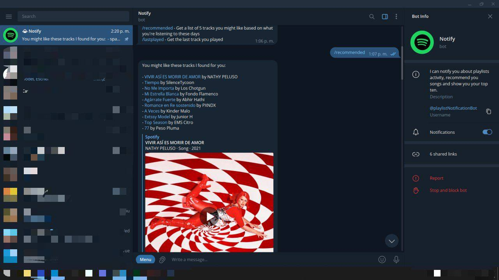

# Notify bot

Notify is a Telegram bot that interacts with your Spotify account. This bot is written in Python and uses the Spotipy library to communicate with the Spotify API.

## Getting Started

Just write `playlistNotificationBot` in your Telegram's app search bar and Notify bot should show up.

### Usage

Notify allows you to interact with your Spotify account information from Telegram, with features like playlists activity notifications, song suggestions and even know what your top ten looks like as of right now. The following commands are available:

- `/notify`: Start tracking a playlist to get notified when someone else adds or removes a song from it.
- `/removenotify`: Stop tracking a playlist.
- `/shownotifylist`: Get a list of the tracked playlists.
- `/myplaylists`: Get a list of the playlists you own.
- `/mytopten`: Get a list of the top 10 songs you listen to the most lately.
- `/recommended`: Get a list of 5 tracks you might like based on what you're listening to these days.
- `/lastplayed`: Get the last track you played.

#### Development

As for now, Notify Bot is in development mode, and that means you need to [contact me](mailto:adanescollante@gmail.com) in order to allow you to use the bot. I'm currently working with the Spotify for Developers team to automate this process so that anyone can use the bot without needing to request access.

#### License

This project is licensed under the MIT License - see the [LICENSE](https://github.com/rafacovez/notify/blob/main/LICENSE) file for details.
