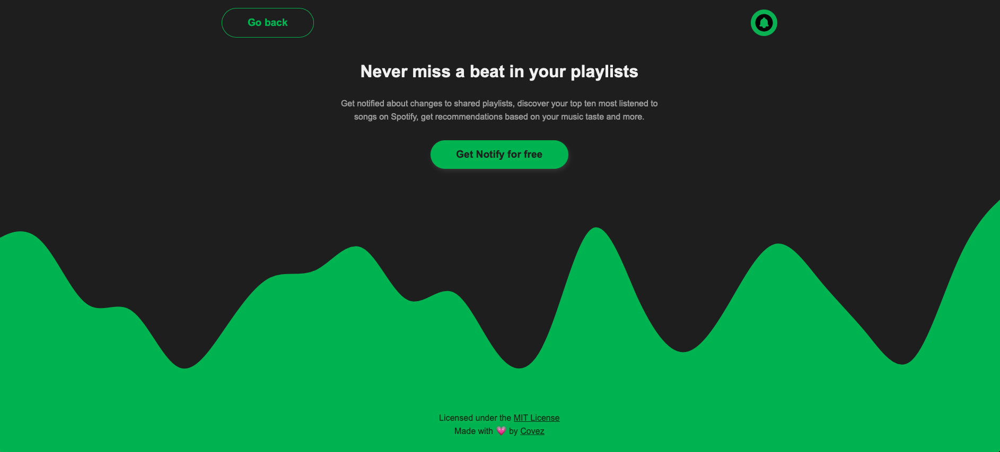

# Notify

A modular, containerized Telegram bot for Spotify playlist tracking and personal listening statistics.



## Table of Contents

- [Project Overview](#project-overview)
- [Features](#features)
- [Architecture](#architecture)
- [Technology Stack](#technology-stack)
- [Project Structure](#project-structure)
- [Environment Configuration](#environment-configuration)
  - [Environment Variables](#environment-variables)
- [Docker & Containerization](#docker--containerization)
  - [Multi-Stage Dockerfile](#multi-stage-dockerfile)
  - [Docker Compose](#docker-compose)
  - [Persistence](#persistence)
- [Developer Experience](#developer-experience)
- [Running the Project](#running-the-project)
  - [Production Mode](#production-mode)
  - [Development Mode](#development-mode)
- [Roadmap](#roadmap)
- [License](#license)

---

## Project Overview

**Notify** is an open-source Telegram bot designed to monitor Spotify playlists and provide personalized listening insights. It detects playlist changes (track additions and removals) and generates listening statistics such as Top Tracks across short, medium, and long-term periods.

The project emphasizes clean separation of concerns, service-oriented design, and full containerization to support both local development and future production deployments.

---

## Features

- 🎶 Track Spotify playlist additions and removals
- 📊 View personal Spotify listening statistics
- 🤖 Telegram-based command interface
- 🔐 Admin-restricted sensitive commands
- 🐳 Fully Dockerized with multi-stage builds
- 🔁 Hot-reloading development environment

---

## Architecture

Notify follows a **service-oriented and modular architecture**:

- Bot logic is isolated from API and persistence layers
- Spotify integration and database access are abstracted behind service interfaces
- Configuration is centralized and environment-driven

This structure allows the project to scale in complexity without becoming tightly coupled or difficult to maintain.

---

## Technology Stack

- **Language:** [Python](https://www.python.org/doc/) 3.13
- **Telegram Bot:** `pyTelegramBotAPI` [(Telebot)](https://github.com/eternnoir/pyTelegramBotAPI)
- **Spotify API:** [Spotipy](https://github.com/spotipy-dev/spotipy)
- **Web Server:** [Flask](https://github.com/pallets/flask) (OAuth2 callback handling)
- **Database:** [SQLite](https://sqlite.org/docs.html)
- **Containerization:** [Docker](https://docs.docker.com/), [Docker Compose](https://docs.docker.com/compose/)
- **Dev Environment:** [VS Code Dev Containers](https://code.visualstudio.com/docs/devcontainers/containers)

---

## Environment Configuration

All runtime configuration is managed through environment variables loaded from a dedicated file:

```text
src/config/.env.local
```

This file is required for both local execution and containerized deployments.
Keeping configuration centralized ensures consistency across development, staging, and production environments.

---

## Docker & Containerization

Notify is fully containerized using Docker, with an emphasis on reproducibility, minimal runtime images, and a clean separation between development and production environments.

---

### Multi-Stage Dockerfile

The project uses an Alpine-based **multi-stage Docker build**:

- **base**  
  Provides a shared Python 3.13 runtime and common system dependencies.

- **dev**  
  Extends the base image with development tooling and `watchdog`, enabling hot-reloading when source files change.

- **prod**  
  Produces a lean runtime image with all build-time dependencies (such as `gcc` and `musl-dev`) removed to reduce image size and attack surface.

This structure ensures fast iteration during development while keeping production images small and secure.

---

### Docker Compose

Docker Compose is used for orchestration and runtime configuration:

- Environment variables are injected from `src/config/.env.local`
- Ports are mapped dynamically using variable substitution
- Multiple compose files can be layered to switch behavior by environment

Example port mapping:

```yaml
ports:
  - "${HOST_PORT}:${CONTAINER_PORT}"
```

---

### Persistence

Local persistence is handled through a volume mount:

```
./data  →  /code/data
```

This ensures the SQLite database persists across container restarts and rebuilds, making it suitable for development and testing workflows.

---

## Developer Experience

Notify includes a **VS Code Dev Container** configuration designed to provide a fast and consistent onboarding experience for contributors:

- A fully configured Python 3.13 development environment
- Preinstalled system dependencies and recommended VS Code extensions
- Automatic port forwarding based on environment variables
- Injection of `src/config/.env.local` into the container shell
- Hot-reloading enabled via the development Docker target

This setup allows developers to open the repository in VS Code and start working immediately, without manual environment configuration.

---

## Running the Project

The application can be executed in two distinct modes, depending on whether stability or rapid iteration is the priority.

---

### Production Mode

Build and run the optimized production container in detached mode:

```bash
docker compose up --build -d
```

### Development Mode

Run the application with hot-reloading enabled by combining the base and development compose files:

```bash
docker compose \
  -f docker-compose.yml \
  -f docker-compose.dev.yml \
  up --build
```

This activates the dev Docker target and watches the source code for changes in real time, making it ideal for active development.

---

## Roadmap

- 🗄️ Migration from SQLite to PostgreSQL  
  Replace the local SQLite database with PostgreSQL to support scalability, concurrency, and production-grade persistence.

- 👥 Multi-user support  
  Introduce per-user Spotify authentication and data isolation, enabling multiple Telegram users to interact with the bot independently.

- 🔔 Configurable notifications  
  Allow users to customize which playlists are tracked, how often checks occur, and how notifications are delivered.

- 📈 Extended analytics  
  Expand listening statistics with richer historical insights and comparative trends over time.

- 🧪 Quality & automation  
  Improve test coverage and introduce a CI pipeline for linting, testing, and container validation.

---

## License

This project is licensed under the MIT License.  
See the `LICENSE` file for details.
